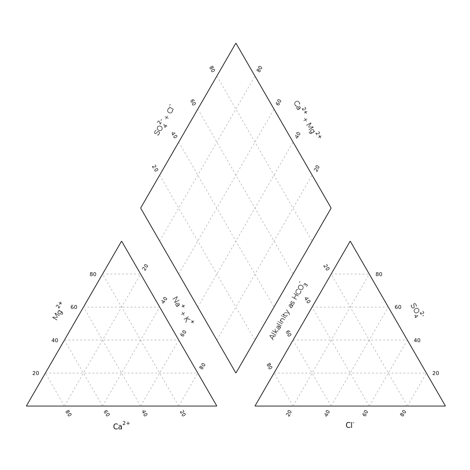
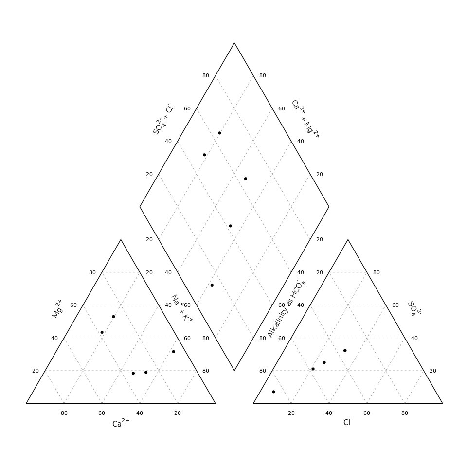
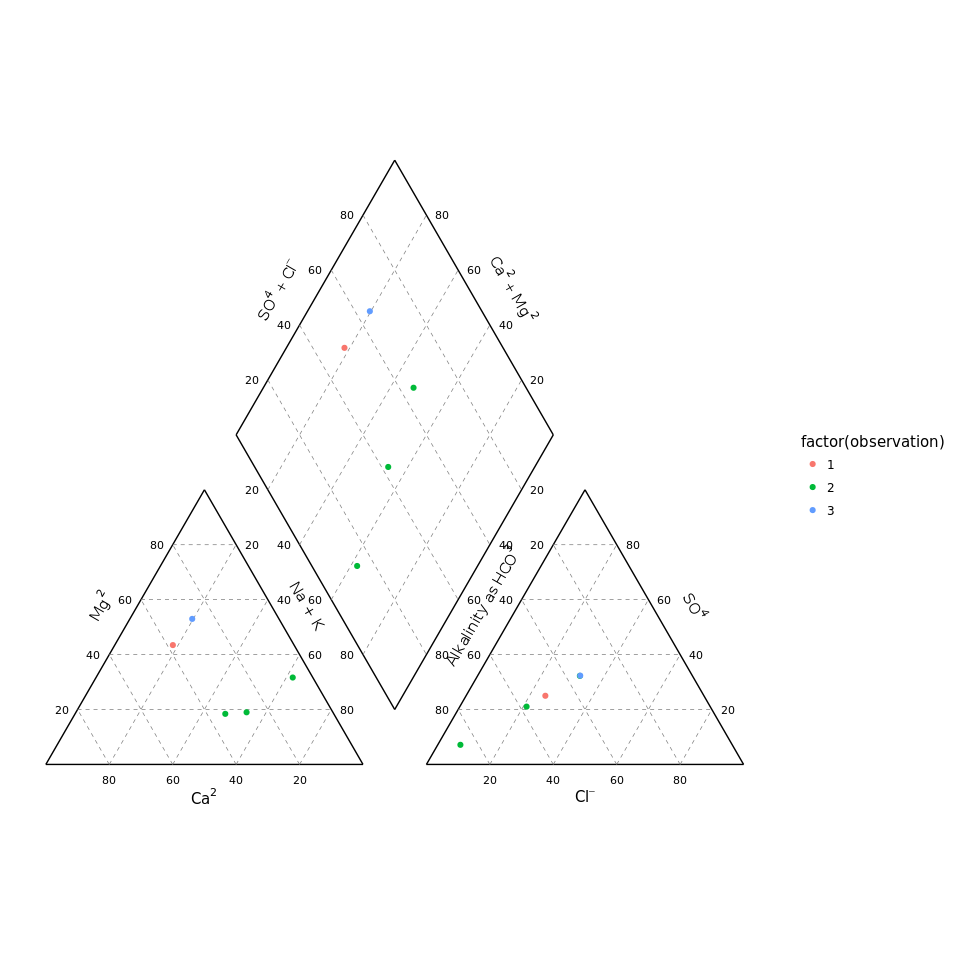
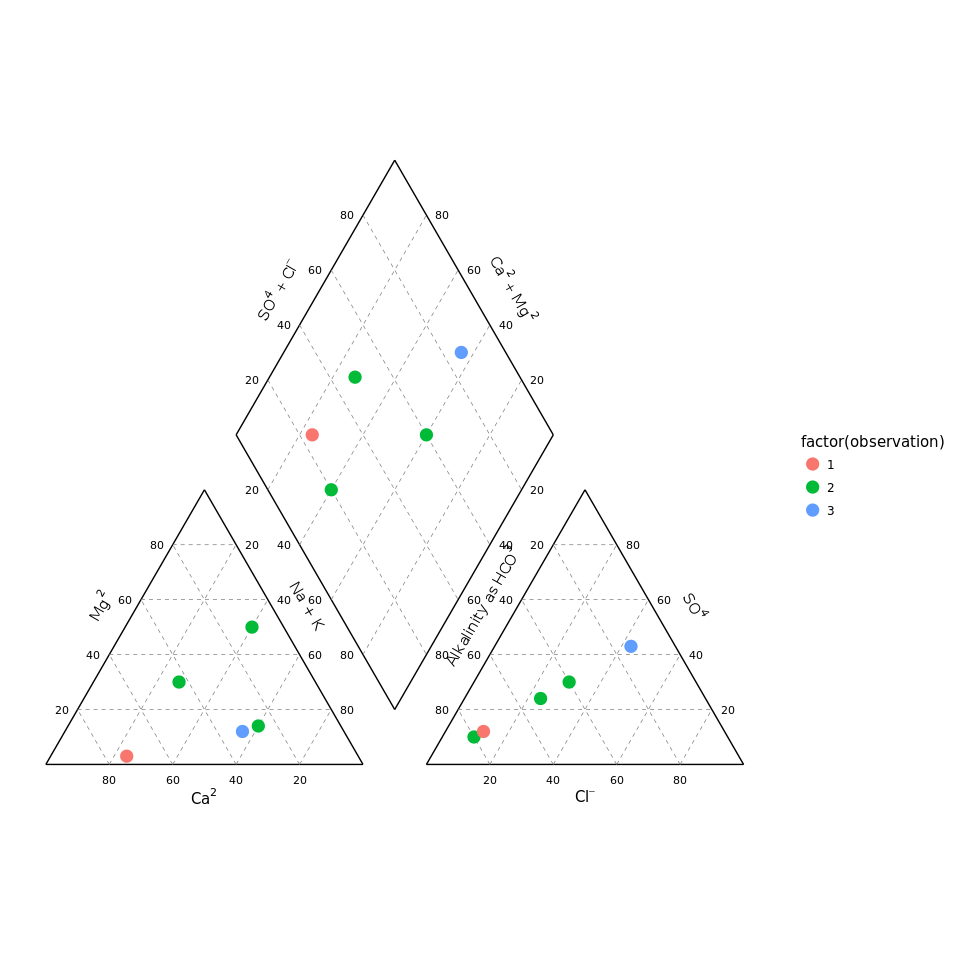
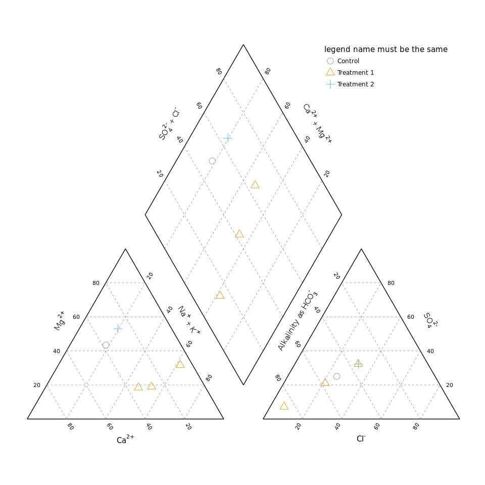

ggplot Piper Diagram
================
January 24, 2018

**This is a fork of the gist <https://gist.github.com/johnDorian/5561272> (by Jason Lessels, <jlessels@gmail.com>).** Forking a gist into a git-repository unfortunatenly does not preserve the relation to the forked project, sorry for that.

Jasons comments:

A piper diagram based on the ternary plot example here: <http://srmulcahy.github.io/2012/12/04/ternary-plots-r.html>. (this link is broken, *Note from Marko, Jan 2018*) This was written quickly, and most likely contains bugs - I advise you to check it first.

This now consists of two functions. *transform\_piper\_data()* transforms the data to match the coordinates of the piper diagram. *ggplot\_piper()* does all of the background.

Example
=======

``` r
source("ggplot_Piper.R")
```

Data input
----------

``` r
data <- as.data.frame(list("Ca"  = c(43, 10, 73, 26, 32),
                        "Mg"  = c(30, 50, 3, 14, 12),
                        "Cl"  = c(24, 10, 12, 30, 43),
                        "SO4" = c(24, 10, 12, 30, 43),
                        "WaterType" = c(2, 2, 1, 2, 3)),
                   row.names = c("A", "B", "C", "D", "E"))
data
```

    ##   Ca Mg Cl SO4 WaterType
    ## A 43 30 24  24         2
    ## B 10 50 10  10         2
    ## C 73  3 12  12         1
    ## D 26 14 30  30         2
    ## E 32 12 43  43         3

Transformation
--------------

``` r
piper_data <- transform_piper_data(Ca = data$Ca,
                                   Mg = data$Mg,
                                   Cl = data$Cl,
                                   SO4 = data$SO4,
                                   name = data$WaterType)

piper_data
```

    ##    observation     x         y
    ## 1            2  42.0  25.98090
    ## 2            2  65.0  43.30150
    ## 3            1  25.5   2.59809
    ## 4            2  67.0  12.12442
    ## 5            3  62.0  10.39236
    ## 6            2 156.0  20.78472
    ## 7            2 135.0   8.66030
    ## 8            1 138.0  10.39236
    ## 9            2 165.0  25.98090
    ## 10           3 184.5  37.23929
    ## 11           2  97.5 122.11023
    ## 12           2  90.0  86.60300
    ## 13           1  84.0 103.92360
    ## 14           2 120.0 103.92360
    ## 15           3 131.0 129.90450

Plot
----

The piper function now just plots the background

``` r
ggplot_piper()
```



Now points can be added like...

``` r
ggplot_piper() + geom_point(aes(x,y), data=piper_data)
```



... colouring the points can be done using the observation value

``` r
ggplot_piper() + geom_point(aes(x,y, colour=factor(observation)), data=piper_data)
```



The size can be changed like..

``` r
ggplot_piper() + geom_point(aes(x,y, colour=factor(observation)), size=4, data=piper_data)
```



Advanced example:

``` r
ggplot_piper() + 
  geom_point(aes(x, y,
                 colour = factor(observation),
                 shape  = factor(observation)), 
             size=4, data = piper_data) + 
  scale_colour_manual(name="legend name must be the same", values=c("#999999", "#E69F00", "#56B4E9"), labels=c("Control", "Treatment 1", "Treatment 2")) +
  scale_shape_manual(name="legend name must be the same", values=c(1,2,3), labels=c("Control", "Treatment 1", "Treatment 2")) +
  theme(legend.position = c(.8, .9))
```


